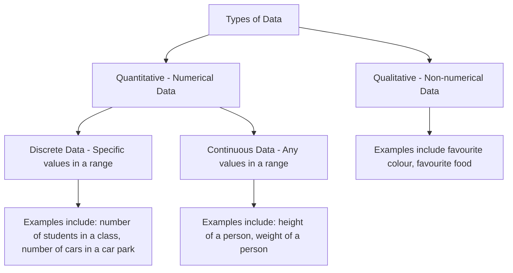
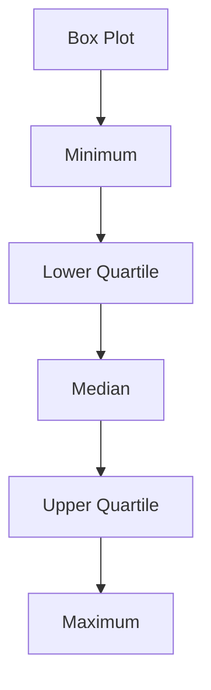

# Statistics 1
## Table of Contents
- [Statistics 1](#statistics-1)
  - [Table of Contents](#table-of-contents)
  - [Chapter 1: Mathematical Modelling](#chapter-1-mathematical-modelling)
    - [1.1 Mathematical Modelling](#11-mathematical-modelling)
    - [1.2 Designing a Model](#12-designing-a-model)
  - [Chapter 2: Measures of Location and Spread](#chapter-2-measures-of-location-and-spread)
    - [2.1 Types of Data](#21-types-of-data)
    - [2.2 Measures of Central Tendency](#22-measures-of-central-tendency)
    - [2.3 Other Measures of Location](#23-other-measures-of-location)
    - [2.4 Measures of Spread](#24-measures-of-spread)
    - [2.5 Variance and Standard Deviation](#25-variance-and-standard-deviation)
    - [2.6 Coding](#26-coding)
  - [Chapter 3: Representations of Data](#chapter-3-representations-of-data)
    - [3.1 Histograms](#31-histograms)
    - [3.2 Outliers](#32-outliers)
    - [3.3 Box Plots](#33-box-plots)
    - [3.4 Stem and Leaf Plots](#34-stem-and-leaf-plots)
    - [3.5 Skewnness](#35-skewnness)
    - [3.6 Comparing Data](#36-comparing-data)
  - [Chapter 4: Probability](#chapter-4-probability)
    - [4.1 Understanding The Vocabulary used in Probability](#41-understanding-the-vocabulary-used-in-probability)
    - [4.2 Venn Diagrams](#42-venn-diagrams)
    - [4.3 Mutually Exclusive and Independent Events](#43-mutually-exclusive-and-independent-events)
    - [4.4 Set Notation](#44-set-notation)
    - [4.5 Conditional Probability](#45-conditional-probability)
    - [4.6 Conditional Probability in Venn Diagrams](#46-conditional-probability-in-venn-diagrams)
    - [4.7 Probability Formulae](#47-probability-formulae)
    - [4.8 Tree Diagrams](#48-tree-diagrams)
  - [Chapter 5: Correlation and Regression](#chapter-5-correlation-and-regression)
    - [5.1 Scatter Diagrams](#51-scatter-diagrams)
    - [5.2 Linear Regression](#52-linear-regression)
    - [5.3 Calculating Least Squares Linear Regression](#53-calculating-least-squares-linear-regression)
    - [5.4 The Product Moment Correlation Coefficient](#54-the-product-moment-correlation-coefficient)
  - [Chapter 6: Discrete Random Variables](#chapter-6-discrete-random-variables)
    - [6.1 Discrete Random Variables](#61-discrete-random-variables)
    - [6.2 Finding the Cumulative Distribution Function for a Discrete Random Variable](#62-finding-the-cumulative-distribution-function-for-a-discrete-random-variable)
    - [6.3 Expected Value of a Discrete Random Variable](#63-expected-value-of-a-discrete-random-variable)
    - [6.4 Variance of a Discrete Random Variable](#64-variance-of-a-discrete-random-variable)
    - [6.5 Expected Value and Variance of a Function of X](#65-expected-value-and-variance-of-a-function-of-x)
    - [6.6 Solving Problems Involving Discrete Random Variables](#66-solving-problems-involving-discrete-random-variables)
    - [6.7 Using Discrete Uniform Distribution as a Model for the Probability Distribution of the Outcomes of Certain Experiments](#67-using-discrete-uniform-distribution-as-a-model-for-the-probability-distribution-of-the-outcomes-of-certain-experiments)
  - [Chapter 7: The Normal Distribution](#chapter-7-the-normal-distribution)
    - [7.1 The Normal Distribution](#71-the-normal-distribution)
    - [7.2 Using Tables to Find Probabilities of The Standard Normal Distribution Z](#72-using-tables-to-find-probabilities-of-the-standard-normal-distribution-z)
    - [7.3 Using Tables to find The Value of Z for a Given Probability](#73-using-tables-to-find-the-value-of-z-for-a-given-probability)
    - [7.4 The Standard Normal Distribution](#74-the-standard-normal-distribution)
    - [7.5 Finding μ and σ](#75-finding-μ-and-σ)
  - [All Chapter's Summary](#all-chapters-summary)
    - [Chapter 1 Summary](#chapter-1-summary)
    - [Chapter 2 Summary](#chapter-2-summary)
    - [Chapter 3 Summary](#chapter-3-summary)
    - [Chapter 4 Summary](#chapter-4-summary)
      - [Probability Formulae](#probability-formulae)
    - [Chapter 5 Summary](#chapter-5-summary)
    - [Chapter 6 Summary](#chapter-6-summary)
    - [Chapter 7 Summary](#chapter-7-summary)

###
###
## Chapter 1: Mathematical Modelling
### 1.1 Mathematical Modelling
- A `mathematical model` is a `simplification` of a real-world situation. They are used to make `predictions` about the real world.
- It is a representation of a real-world situation using mathematical concepts and language.
- Mathematical `models` are used to:
  - Describe the real-world situation
  - Predict the behaviour of the real-world situation
  - Explain the behaviour of the real-world situation

Advantages | Disadvantages
---|---
They are relatively quick and easy to make | They are often inaccurate as they are simplifications of the real-world situation
The help predictions to be made | The model may only work in certain situations

### 1.2 Designing a Model
- The process of designing a model involves:
  1) Identifying the real-world situation
  1) A model is devised
  1) Model is used to make predictions about the real-world situation
  1) Experimental data are collected from the real-world
  1) Comparing the predictions with the experimental data
  1) Statistical analysis is used to determine the accuracy of the model
  1) Model is `refined` if necessary


#
## Chapter 2: Measures of Location and Spread
### 2.1 Types of Data
- We collect in statistics. Variables associated with non-numerical data are called `qulatiative variables`. Variables associated with numerical data are called `quantitative variables`.
- The flow chart below shows the process of collecting data:


### 2.2 Measures of Central Tendency
A `measure of location` is a single value which describes a set of data. It is used to describe the `centre` of a set of data. The three most common measures of location are:
  - `Mean`
    - The `mean` is the `average` of a set of data. It is calculated by adding all the values in a set of data and dividing by the number of values in the set.
    - Formula for the mean is:
    $$\bar{x} = \frac{\sum_{} x}{n}$$
  - `Median`
    - The `median` is the `middle` value in a set of data. It is calculated by arranging the data in order of size and finding the middle value.
  - `Mode`
    - The `mode` is the `most frequent` value in a set of data. It is calculated by finding the value which occurs most often in a set of data.
- Combining Means
  - If two sets of data have the same number of values, the mean of the combined set of data is calculated by adding the means of the two sets of data and dividing by 
  $$\bar{x} = \frac {n_1 \bar{x_1} + n_2 \bar{x_2}} 2 $$
   
- You can calcualte the mean and median for discrete data from the frequency table. The formula for the mean is:
$$\bar{x} = \frac{\sum_{xf}} {\sum_{f}}$$
- The formula for the median is:
$$\frac{\sum_{xf}} 2$$

### 2.3 Other Measures of Location
- The medain describes the middle of the data set. It splits the data into two halfs. You can calculate the other `Measures of Location` such as the `quartiles` and `percentiles`.
- Below is an example layout of a box plot:

- Use these rules to find the upper and lower quartiles for `discrete data`:
  - To find the lower quartile, divide n by 4, if this is a whole number, the lower quartile is halfway between the datapoint and the one above. If it is not a whole number, `round up` and pick that data point.
    - The formula for the lower quartile is: 
    $$ \frac{n}{4} $$

  - To find the upper quartile, multiply n by 3 and divide by 4, if this is a whole number, the upper quartile is halfway between the datapoint and the one below. If it is not a whole number, `round up` and pick that data point.
    - The formula for the upper quartile is: 
    $$ \frac{3}{4} n $$

- When data is presented in a grouped table we can use a technique called `interpolation` to find the quartiles. Interpolation is a method of estimating a value between two known values. When we use interpolation we asume that the data is `evenly distributed`
  
### 2.4 Measures of Spread
- A measure of spread is a single value which describes how spread out the data is. The three most common measures of spread are:
  - `Range`
    - The `range` is the `difference` between the `largest` and `smallest` values in a set of data.
    - The formula for the range is:
    $$R = x_{max} - x_{min}$$
  - `Interquartile Range`
    - The `interquartile range` is the `difference` between the `upper quartile` and the `lower quartile`.
    - The formula for the interquartile range is:
    $$IQR = Q_3 - Q_1$$
  - `Interpercentile Range`
    - The `interpercentile range` is the `difference` between the `upper percentile` and the `lower percentile`.
    - The formula for the interpercentile range is:
    $$IPR = P_3 - P_1$$

### 2.5 Variance and Standard Deviation
- The `variance` is a measure of spread which describes how spread out the data is. It is calculated by finding the `mean` of the `squared differences` between each value and the `mean` of the data set.'
- The formula for the variance is:
$$\sigma^2 = \frac{\sum_{(x - \bar{x})^2}} n$$
- An other simpiler way to calculate the variance is:
$$\sigma^2 = \frac {\sum_{x^2}}{n} - (\frac {\sum_{x}}{n})^2$$
- The `standard deviation` is a measure of spread which describes how spread out the data is. It is calculated by taking the `square root` of the `variance`.
- The formula for the standard deviation is:
$$\sigma = \sqrt{\frac{\sum_{(x - \bar{x})^2}} n}$$
- A simpiler way to calculate the standard deviation is:
$$\sigma = \sqrt{\frac {\sum_{x^2}}{n} - (\frac {\sum_{x}}{n})^2}$$

### 2.6 Coding
- The `coding` of data is the process of converting qualitative data into numerical data. This is done so values are easier to work with
- The formula for coding is:
$$y = \frac {x - a} {b}$$

- If data is coded using the formula above, the `mean` of the data is 0 and the `standard deviation` is 1.
  - To calculate the mean of the data, use the formula:
  $$\bar{y} = \frac {\bar{x} - a} b$$
  - To calculate the standard deviation of the data, use the formula:
  $$\sigma_y = \frac {\sigma_x} b$$
  - Where $\bar{y}$ is the mean of the coded data, $\bar{x}$ is the mean of the original data, $\sigma_y$ is the standard deviation of the coded data, $\sigma_x$ is the standard deviation of the original data, $a$ is the lowest value in the original data and $b$ is the difference between the highest and lowest values in the original data.


#
## Chapter 3: Representations of Data
### 3.1 Histograms
- A `histogram` is a `graphical representation` of a `frequency distribution`. It is used to show the `frequency` of each `class` in a `grouped frequency table`.
  - The `area` of a bar is the `frequency` of the class.
  - The `height` of a bar is the `relative frequency` of the class.
  - The `width` of a bar is the `class interval`.
  - In a histogram to calculate the height of ceach bar `(The Frequency Density)` we use this formula:
    $$\text{frequency density} = \frac {\text{frequency}} {\text{class width}}$$ 

- The `mean` of a histogram is the `midpoint` of the `class` with the `highest frequency`.
- The `median` of a histogram is the `midpoint` of the `class` with the `highest frequency`.
- The `mode` of a histogram is the `midpoint` of the `class` with the `highest frequency`.
- The `range` of a histogram is the `difference` between the `largest` and `smallest` values in a set of data.
- The `interquartile range` of a histogram is the `difference` between the `upper quartile` and the `lower quartile`.
  
- Joining the middle of the top of each bar in a historgram forms a frequency polygon.
  
### 3.2 Outliers
- An `outlier` is a value which is `extremely` different from the rest of the data.
- A common definition of an outlier is any value that is:
  - either `greater then` $Q_3 + k(Q_3 - Q_1)$
  - or `less then` $Q_1 - k(Q_3 - Q_1)$

- `The process of removing anomalies from a data set is knows as cleaning the data.`
  
### 3.3 Box Plots
- A `box plot` is a `graphical representation` of a `frequency distribution`. It is used to show the `frequency` of each `class` in a `grouped frequency table`.
  - The `box` is the `interquartile range` of the data.
  - The `line` in the middle of the box is the `median` of the data.
  - The `whiskers` are the `range` of the data.
  - The `dots` are the `outliers` of the data.
  - The `mean` of the data is the `midpoint` of the `class` with the `highest frequency`.
  - The `median` of the data is the `midpoint` of the `class` with the `highest frequency`.
  - The `mode` of the data is the `midpoint` of the `class` with the `highest frequency`.
  - The `range` of the data is the `difference` between the `largest` and `smallest` values in a set of data.
  - The `interquartile range` of the data is the `difference` between the `upper quartile` and the `lower quartile`.

- The `mean` of a box plot is the `midpoint` of the `class` with the `highest frequency`.
- The `median` of a box plot is the `midpoint` of the `class` with the `highest frequency`.
- The `mode` of a box plot is the `midpoint` of the `class` with the `highest frequency`.
- The `range` of a box plot is the `difference` between the `largest` and `smallest` values in a set of data.
- An outlier is a value which is `extremely` different from the rest of the data.
  - it falls either $1.5 \times IQR$ below the lower quartile or $1.5 \times IQR$ above the upper quartile.

### 3.4 Stem and Leaf Plots
- A `Steam and leaf diagram` is used in order to present data given to 2 or 3 significant figures.
- It enables the shape of the data to be seen.
- 2 sets of data can be compared using a back to back stem and leaf diagram.
  
### 3.5 Skewnness
- `Skewness` is a measure of the `asymmetry` of a `frequency distribution`.
- A distribution can be `symmetrical`, `posotive` or `negative` skew
- Data which are spread evenly around the mean are `symmetrical`.
- Data which are mostly at the lower end of the range are `positive` skew.
- Data which are mostly at the upper end of the range are `negative` skew.
  
- The Formula for `skewness` is:
  $$\text{skewness} = \frac {3(\text{mean} - \text{median})} {\text{standard deviation}}$$
  - A value of 0 means the data is `symmetrical`.
  - A value of less then 0 means the data is `positive` skew.
  - A value of more then 0 means the data is `negative` skew.
  
### 3.6 Comparing Data
- `Comparing data` is the process of comparing two or more sets of data.
- When comparing data you can comment on the following:
  - `Measure of Location`
  - `Measure of Spread`

- You can compare data using the following:
  - `Mean`
  - `Median`
  - `Interquartile Range`
  - `Standard Deviation`


#
## Chapter 4: Probability
### 4.1 Understanding The Vocabulary used in Probability
- `Probability` is the `likelihood` of an `event` occuring.
  - An `experiment` is a process that can have more than one outcome.
  - An `event` is a particular outcome of an experiment.
  - A `sample space` is the se` of all possible outcomes.
- Where outcomes are `equally likely` the `probability` of an event occuring is:
  $$\text{probability} = \frac {\text{number of favourable outcomes}} {\text{number of possible outcomes}}$$

### 4.2 Venn Diagrams
- A `Venn Diagram` is a diagram used to show the `relationship` between `sets`.
- A `rectangle`, $\Omega$, is used to represent the `sample space`.
- A `circle` is used to represent a `set`.
- The `intersection` of two sets is the `common elements` of the sets.
- The `union` of two sets is the `combined elements` of the sets.
- The `complement` of a set is the `elements` that are `not` in the set.
- The `complement` of a set is represented by a `circle` with a `line` through it.
- The `complement` of a set is the `sample space` minus the set.
- The `complement` of a set is represented by a `circle` with a `line` through it.

- The following Venn Diagram has the following:
  - an smaple space (The rectangle)
  - an set A (The circle)
  - an set B (The circle)
  - and intersection of A and B (The intersection of the two circles)


- To calcualte P(A) we use this formula:
  $$P(A) = \frac {\text{A}} {\text{n}}$$

- To calcualte P(B) we use this formula:
  $$P(B) = \frac {\text{B}} {\text{n}}$$

- To calcualte P(A $\cap$ B) we use this formula:
  $$P(A \cap B) = P(A) × P(B)$$
  - Where the $\cap$ symbol means `intersection`.

- To calcualte P(A $\cup$ B) we use this formula:
  $$P(A \cup B) = P(A) + P(B) - P(A \cap B)$$
  - Where the $\cup$ symbol means `union`.

- To calcualte P(A') we use this formula:
  $$P(A') = 1 - P(A)$$
  - Where the ' symbol means `complement`.

- To calcualte P(A $\cup$ B') we use this formula:
  $$P(A \cup B') = P(A) + P(B') - P(A \cap B')$$
  - Where the $\cup$ symbol means `union`.
  - Where the ' symbol means `complement`.

- To calcualte P(A $\cap$ B') we use this formula:
  $$P(A \cap B') = P(A) - P(A \cap B)$$
  - Where the $\cap$ symbol means `intersection`.
  - Where the ' symbol means `complement`.

- To calcualte P(A | B) we use this formula:
  $$P(A | B) = \frac {P(A \cap B)} {P(B)}$$
  - Where the | symbol means `given`.

- To calcualte P(A | B') we use this formula:
  $$P(A | B') = \frac {P(A \cap B')} {P(B')}$$
  - Where the | symbol means `given`.
  - Where the ' symbol means `complement`.

### 4.3 Mutually Exclusive and Independent Events
- `Mutually Exclusive` events are events that cannot occur at the same time.
- `Independent` events are events that do not affect each other.
- `Mutually Exclusive` and `Independent` events are `disjoint` events.
- `Mutually Exclusive` and `Independent` events are represented by a `Venn Diagram` with a `line` through the `intersection` of the two sets.
- `Mutually Exclusive` and `Independent` events are represented by a `Venn Diagram` with a `line` through the `intersection` of the two sets.

### 4.4 Set Notation
- `Set Notation` is a way of writing sets.
- The `empty set` is represented by $\emptyset$.
- The `universal set` is represented by $\Omega$.

### 4.5 Conditional Probability
- Conditional probability is the probability of an event occuring given that another event has already occured.
- The formula for conditional probability is:
  $$P(A | B) = \frac {P(A \cap B)} {P(B)}$$
  - Where the | symbol means `given`.
  - Where the $\cap$ symbol means `intersection`.

### 4.6 Conditional Probability in Venn Diagrams
- Conditional Probability in Venn Diagrams is the probability of an event occuring given that another event has already occured.'
- It is represented by a `Venn Diagram` with a `line` through the `intersection` of the two sets.
- It works by using the formula:
  $$P(A | B) = \frac {P(A \cap B)} {P(B)}$$
  - Where the | symbol means `given`.
  - Where the $\cap$ symbol means `intersection`.

### 4.7 Probability Formulae
- We have coverd these in the end of chapter 4.
  
### 4.8 Tree Diagrams
- A `Tree Diagram` is a diagram used to show the `relationship` between `sets`.
- A Tree Diagram is used to show the `probability` of an `event` occuring.
- It looks like a `tree` with `branches` and `leaves`.
- This is a tree diagram with 3 branches and 2 leaves:
```text
    a
   / \
  a   b
 / \
a   b
```
- To calculate the probability of a happening 2 times in a row we use this formula:
  $$\text{P(a twice)} = P(A) × P(A)$$

- To calculate the probability of a happening 3 times in a row we use this formula:
  $$\text{P(a thrice)} = P(A) × P(A) × P(A)$$

- To calculate the probability of a happening 0 times in a row we use this formula:
  $$\text{P(a 0 times)} = P(A') × P(A')$$

- To calculate the probability of a happening and then b happening we use this formula:
  $$\text{P(a then b)} = P(A) × P(B)$$

- To calculate the probability of a happening and then b happening and then c happening we use this formula:
  $$\text{P(a then b then c)} = P(A) × P(B) × P(C)$$


#
## Chapter 5: Correlation and Regression
### 5.1 Scatter Diagrams
- A `Scatter Diagram` is a diagram used to show the `relationship` between `sets`.
- `Bivariate Data` is data that has two variables.
- You can represent `Bivariate Data` in a `Scatter Diagram`.

- Correlation is a measure of how closely two variables are related.
- Correlation is represented by the symbol `r`.
- Correlation is a number between -1 and 1.
- Correlation trends in a scatter plot:
  - if the x and y values are both increasing, the correlation is `positive`.
  - if the x and y values are both decreasing, the correlation is `negative`.
  - if the x and y values are `increasing` and `decreasing`, the correlation is 0.
  - if the x and y values are `not` related, the correlation is 0.
  - if the x and y values are related, the correlation is `not` 0.

- An `independent variable` is a variable that is `independent` of another variable. and it is plotted on the `x-axis`.
- A `dependent variable` is a variable that is `dependent` on another variable. and it is plotted on the `y-axis`.

### 5.2 Linear Regression
- When a scatter diagram shows correlation, we can use `linear regression` to find the `best fit` line.
- One type of line of best fit, is the `least squares regression line`.
- `Least squares regression line`:
  - The regression line of $y$ on $x$ is written as $y = a + bx$.

  - The cofficents $a$ and $b$ are found by:
    $$b = \frac {\sum_{i=1}^{n} (x_i - \bar{x})(y_i - \bar{y})} {\sum_{i=1}^{n} (x_i - \bar{x})^2}$$
    
    $$a = \bar{y} - b \bar{x}$$

  - If the data has a `posotive correlation`, $b$ wil be posotive
  
  - If the data has a `negative correlation`, $b$ wil be negative

  - If the data has a `no correlation`, $b$ wil be 0

- If you know the value of the `independent variable` from a bivariate data set, you can use the `least squares regression line` to find the `dependent variable`.
  - You should only use the `least squares regression line` to make predictions for values within the range of the `given data`.

### 5.3 Calculating Least Squares Linear Regression
- `Least squares regression` is always in the form of $y = a + bx$
- The least squares regression line is the line that minimises the `sum of the squares of the residuals`.
  - The `residuals` are the `vertical distances` between the `data points` and the `least squares regression line`.
  
- The equation to find regression line og y on x is:
  - $y = a + bs$
  
  - Where $a = \bar{y} - b \bar{x}$ and $b = \frac {S_{xy}} {S_{xx}}$.

- $S_{xy}$ and $S_{xx}$ are known as summary satatistics and you can calculate them using these formulae:
  $$S_{xy} = \sum{xy} - \frac {\sum{x} \sum{y}} {n}$$
  $$S_{xx} = \sum{x^2} - \frac {\sum{x}^2} {n}$$
  $$S_{yy} = \sum{y^2} - \frac {\sum{y}^2} {n}$$

### 5.4 The Product Moment Correlation Coefficient
- The `product moment correlation coefficient (PMCC)` is a measure of the `strength` of the `linear relationship` between two variables. The PMCC is a number between -1 and 1.
  - If the PMCC is 1, the variables are `perfectly` `positively` `correlated`.
  - If the PMCC is -1, the variables are `perfectly` `negatively` `correlated`.
  - If the PMCC is 0, the variables are `not` `correlated`.

- The PMCC is calculated using the formula:
  $$r = \frac {S_{xy}} {\sqrt {S_{xx} S_{yy}}}$$

- Sometimes the original data is coded, As long as the coding is `linear`, the PMCC can be calculated using the formula:
  - Examples of linear coding of a data set $x_i$ are $p_i = ax_i + b$ and $p_i = \frac {x_i - a} {b}$
  

  

#
## Chapter 6: Discrete Random Variables
### 6.1 Discrete Random Variables
- A `random variable` is a variable whose value is `random` and depends on the `outcome` of a experiment.
  - The range of values of a random variable is called the `sample space`.
  - A `discrete random variable` is a random variable that can take on `countable` values.
  - A `continuous random variable` is a random variable that can take on `uncountable` values.
  - The variable `random` if the outcome of the experiment is `unknown` before the experiment is carried out.
  
- A `probability distribution` is a table that shows the `probability` of each value of a random variable.
  - The `probability distribution` of a `discrete random variable` is a `frequency table` that shows the `number of times` each value of the random variable occurs in the sample space.
  - The `probability distribution` of a `continuous random variable` is a `frequency polygon` that shows the `number of times` each value of the random variable occurs in the sample space.
  - The `probability distribution` of a `discrete random variable` is a `frequency table` that shows the `number of times` each value of the random variable occurs in the sample space.
  - The `probability distribution` of a `continuous random variable` is a `frequency polygon` that shows the `number of times` each value of the random variable occurs in the sample space.

- as a `probability function`: $P(X = x) = \frac {1} {6}, x = 1, 2, 3, 4, 5, 6$
- Using this table:
  
x | 1 | 2 | 3 | 4 | 5 | 6
---|---|---|---|---|---|---
P(X = x) | $\frac {1}6$ | $\frac {1}6$ | $\frac {1}6$ | $\frac {1}6$ | $\frac {1}6$ | $\frac {1}6$

- All of these represent the same probability distribution.
  - If all the probabilities in a probability distribution are equal, the probability distribution is called a `uniform probability distribution`.
  - If all the probabilities in a probability distribution are `not` equal, it is called a `non-uniform probability distribution`.

### 6.2 Finding the Cumulative Distribution Function for a Discrete Random Variable
- If a particular value of $X$ is $x$, the probability that $X$ is less than or equal to $x$ is written as $F(x)$.

- $F(x)$ is called the `cumulative distribution function` for $X$. and to calculate it you need to add up all the probabilities of $X$ being less than or equal to $x$. This is written as:
  $$F(x) = P(X \leq x)$$

- Like the probability distribution, the `cumulative distribution` can be represented in a `frequency table` or a `frequency polygon`.

### 6.3 Expected Value of a Discrete Random Variable
- If you take a set of observations of a random variable $X$ and calculate the `mean` of the observations, the result is called the `expected value` of $X$.

- The `expected value` of a random variable is written as $E(X)$. It is calculated using the formula:
  $$E(X) = \sum{xP(X = x)}$$

- The `expected value` of a random variable is the `mean` of the `probability distribution` of the random variable.

### 6.4 Variance of a Discrete Random Variable
- The `variance` of a random variable is a measure of the `spread` of the `probability distribution` of the random variable.

- The `variance` of a random variable is written as $Var(X)$ and is calculated using the formula:
  $$Var(X) = E((X - E(X))^2)$$

- The random variable $E((X - E(X))^2)$ is the `mean squared deviation` of $X$ from its `expected value`.

- The easiest way to calculate the `variance` of a random variable is to use the formula:
  $$Var(X) = E(X^2) - (E(X))^2$$

### 6.5 Expected Value and Variance of a Function of X
- If $X$ is a random variable, and $g(x)$ is a function of $X$, then the `expected value` of $g(X)$ is written as $E(g(X))$ and is calculated using the formula:
  $$E(g(X)) = \sum{g(x)P(X = x)}$$

- This is a more general form of $E(X)^2$. For simple functions such as addition and multiplication by a constant, the rules are:
  - If $X$ is a random variable, $a$ and $b$ are constants then $E(X + b) = aE(X) + b$
  - If $X$ and $Y$ are random variables, $a$ and $b$ are constants then $E(X + Y) = E(X) + E(Y)$

- You can use similar rules to find the `variance` of a function.
  - If $X$ is a random variable, $a$ and $b$ are constants then $Var(X + b) = a^2Var(X)$

### 6.6 Solving Problems Involving Discrete Random Variables
- Suppose you have 2 random variables: a variable $X$, and a variable $Y = g(x)$. If g is one-to-one, and you know the `mean` and `variance` of $Y$ then you can find the `mean` and `variance` of $X$.
  - If $Y = g(X)$, $g$ is one-to-one then:
  $$E(Y) = \mu$$
  $$Var(Y) = \sigma^2$$
  $$E(X) = g^{-1}(\mu)$$
  $$Var(X) = g^{-1}(\sigma^2)$$

### 6.7 Using Discrete Uniform Distribution as a Model for the Probability Distribution of the Outcomes of Certain Experiments
- The `discrete uniform distribution` is a `probability distribution` that is used to model the `probability distribution` of the `outcomes` of certain `experiments`.
- The probability distribution for the score $S$ on a signle roll of a dice is:

s | 1 | 2 | 3 | 4 | 5 | 6
---|---|---|---|---|---|---
$P(S = s)$ | $\frac{1}{6}$ | $\frac{1}{6}$ | $\frac{1}{6}$ | $\frac{1}{6}$ | $\frac{1}{6}$ | $\frac{1}{6}$

- This is an example of a `discrete uniform distribution` because the `probability` of each outcome is the same.
  - Conditions for a `discrete uniform distribution`:
    - The `sample space` is a `finite set` of `discrete values`.
    - The `probability` of each outcome is the same.
    - The `probability` of each outcome is $1/n$, where $n$ is the `number of outcomes` in the `sample space`.

- The `expected value` of a `discrete uniform distribution` is the `mean` of the `sample space`:
  $$E(X) = \frac {a + b} {2}$$

- In many cases, $X$ is defined over the set (1, 2, 3 ... n). In this case, the `mean` and `variance` of $X$ are:
  $$E(X) = \frac {n + 1} {2}$$
  $$Var(X) = \frac {(n + 1)(2n + 1)} {12}$$

- You do `not` need to prove these results. But you should be able to use them to solve problems.


#
## Chapter 7: The Normal Distribution
### 7.1 The Normal Distribution
- The `normal distribution` is a `continuous probability distribution` that is used to model many `real-world phenomena`.
- The `normal distribution` is also called the `bell curve` because of its shape.
- The `normal distribution` is a `symmetric` distribution with a `single peak`.

- The `normal distribution` is defined by its `mean` and `standard deviation`.
  - The `mean` is the `expected value` of the `normal distribution`.
  - The `standard deviation` is a measure of the `spread` of the `normal distribution`.

- A continuous random variable has a `continuous probability distribution` this can be shown as a curve on a graph.
- Examples of continuous random variables that have a `normal distribution` include:
  - The `height` of a `person`.
  - The `weight` of a `person`.
  - The `time` it takes to `complete a task`.
  - The `amount of money` in a `bank account`.
  - The `temperature` of a `room`.

- The `peak` of the `normal distribution` is at the `mean` of the `distribution`.
- The `standard deviation` is a measure of the `spread` of the `normal distribution`.
  - The `standard deviation` is the distance from the mean to the point where the curve is half as high as the peak.
  - The `standard deviation` is also the distance from the mean to the point where the curve is half as wide as the peak.

- The `normal distribution`:
  - Has parameters $\mu$ and $\sigma^2$.
  - Is symmetric about the `mean` which is the same as the `median` and `mode`.
  - Has a bell-shaped curve with asymptotes at each end.
  - Total area under the curve is 1.
  - Has points of inflection at $\mu - \sigma$ and $\mu + \sigma$.

For a `normally distributed variable`:
  - $P(\mu - \sigma \leq X \leq \mu + \sigma) = 0.68$
  - $P(\mu - 2\sigma \leq X \leq \mu + 2\sigma) = 0.95$
  - $P(\mu - 3\sigma \leq X \leq \mu + 3\sigma) = 0.997$

### 7.2 Using Tables to Find Probabilities of The Standard Normal Distribution Z
- The `standard normal distribution` is a `normal distribution` with a `mean` of 0 and a `standard deviation` of 1.
- The `standard normal distribution` is also called the `z distribution`.
- The total area under the `standard normal distribution` is 1.
- For a continuous distribution, there is no difference between $P(X \leq x)$ and $P(X < x)$.

### 7.3 Using Tables to find The Value of Z for a Given Probability
- The `z table` is a `table` that shows the `probability` of a `z-score` being less than or equal to a given `z-score`.
- The `z table` is also called the `standard normal table`.

- If $P(Z < a)$ is greater then 0.5, then a > 0.
- If $P(Z < a)$ is less than 0.5, then a < 0.
- If $P(Z > a)$ is greater than 0.5, then a < 0.
- If $P(Z > a)$ is less than 0.5, then a > 0.

### 7.4 The Standard Normal Distribution
- The `standard normal distribution` is a `normal distribution` with a `mean` of 0 and a `standard deviation` of 1.
- We often `standardize` a `random variable` to make it easier to work with.
  - In this case. $\mu = 0$ and $\sigma = 1$.
  - This is written in the format of $X~N(\mu, \sigma^2)$.
    - This is calculated with:
      $$Z = \frac {X - \mu} {\sigma}$$

- For the standerd normal curve $Z~N(0, 1)$, the probability $P(Z < a)$ is sometimes written as $\Phi(a)$.

### 7.5 Finding μ and σ
- We may need to find an `unknown` $\mu$ or $\sigma$ from a `normal distribution`.
- We can find $\mu$ and $\sigma$ from a `normal distribution` using the `empirical rule`.
  - The `empirical rule` is a `rule` that states that for a `normally distributed variable`:
    - $P(\mu - \sigma \leq X \leq \mu + \sigma) = 0.68$
    - $P(\mu - 2\sigma \leq X \leq \mu + 2\sigma) = 0.95$
    - $P(\mu - 3\sigma \leq X \leq \mu + 3\sigma) = 0.997$

#
#
## All Chapter's Summary
### Chapter 1 Summary
- A mathematical model is a simplification of a real-world situation.
- Mathematical models are used to make predictions about the real-world situation.
- The process of designing a model involves identifying the real-world situation, devising a model, making predictions, collecting experimental data, comparing the predictions with the experimental data, statistical analysis and refining the model if necessary.

#
### Chapter 2 Summary
- A `measure of location` is a single value which describes a set of data. It is used to describe the `centre` of a set of data. The three most common measures of location are:
  - `Mean`
  - `Median`
  - `Mode`

- A `measure of spread` is a single value which describes how spread out the data is. The three most common measures of spread are:
  - `Range`
  - `Interquartile Range`
  - `Interpercentile Range`

- The `variance` is a measure of spread which describes how spread out the data is. It is calculated by finding the `mean` of the `squared differences` between each value and the `mean` of the data set.

- The `standard deviation` is a measure of spread which describes how spread out the data is. It is calculated by taking the `square root` of the `variance`.
  - The simple formula for $\sigma$ is:
  $$\sigma = \sqrt{\frac {\sum_{x^2}}{n} - (\frac {\sum_{x}}{n})^2}$$

- The `coding` of data is the process of converting qualitative data into numerical data. This is done so values are easier to work with.
  - The formula for this is:
  $$y = \frac {x - a} {b}$$
  - Where $y$ is the coded value, $x$ is the original value, $a$ is the lowest value in the original data and $b$ is the difference between the highest and lowest values in the original data.

#
### Chapter 3 Summary
- A `histogram` is a `graphical representation` of a `frequency distribution`. It is used to show the `frequency` of each `class` in a `grouped frequency table`.
  - The `area` of a bar is the `frequency` of the class.
  - The `height` of a bar is the `relative frequency` of the class.
  - The `width` of a bar is the `class interval`.
  - In a histogram to calculate the height of ceach bar `(The Frequency Density)` we use this formula:
    $$\text{frequency density} = \frac {\text{frequency}} {\text{class width}}$$

- A `box plot` is a `graphical representation` of a `frequency distribution`. It is used to show the `frequency` of each `class` in a `grouped frequency table`.
  - The `box` is the `interquartile range` of the data.
  - The `line` in the middle of the box is the `median` of the data.
  - The `whiskers` are the `range` of the data.
  - The `dots` are the `outliers` of the data.
  - The `mean` of the data is the `midpoint` of the `class` with the `highest frequency`.
  - The `median` of the data is the `midpoint` of the `class` with the `highest frequency`.
  - The `mode` of the data is the `midpoint` of the `class` with the `highest frequency`.
  - The `range` of the data is the `difference` between the `largest` and `smallest` values in a set of data.
  - The `interquartile range` of the data is the `difference` between the `upper quartile` and the `lower quartile`.

- A `Steam and leaf diagram` is used in order to present data given to 2 or 3 significant figures.

- `Skewness` is a measure of the `asymmetry` of a `frequency distribution`.
  - A distribution can be `symmetrical`, `posotive` or `negative` skew
  - Data which are spread evenly around the mean are `symmetrical`.
  - Data which are mostly at the lower end of the range are `positive` skew.
  - Data which are mostly at the upper end of the range are `negative` skew.

- The Formula for `skewness` is:
  $$\text{skewness} = \frac {3(\text{mean} - \text{median})} {\text{standard deviation}}$$
  - A value of 0 means the data is `symmetrical`.
  - A value of less then 0 means the data is `positive` skew.
  - A value of more then 0 means the data is `negative` skew.

- `Comparing data` is the process of comparing two or more sets of data.

- An `Outlier` is a value which is `extremely` different from the rest of the data.
  - it falls either $1.5 \times IQR$ below the lower quartile or $1.5 \times IQR$ above the upper quartile.

#
### Chapter 4 Summary
#### Probability Formulae
- `Tree Diagrams`
  $$\text{P(a twice)} = P(A) × P(A)$$
  $$\text{P(a thrice)} = P(A) × P(A) × P(A)$$
  $$\text{P(a 0 times)} = P(A') × P(A')$$
  $$\text{P(a then b)} = P(A) × P(B)$$
  $$\text{P(a then b then c)} = P(A) × P(B) × P(C)$$

- `Venn Diagrams`
  $$P(A) = \frac {\text{A}} {\text{n}}$$
  $$P(B) = \frac {\text{B}} {\text{n}}$$
  $$P(A \cap B) = P(A) × P(B)$$
  $$P(A \cup B) = P(A) + P(B) - P(A \cap B)$$
  $$P(A') = 1 - P(A)$$
  $$P(A \cup B') = P(A) + P(B') - P(A \cap B')$$
  $$P(A \cap B') = P(A) - P(A \cap B)$$
  $$P(A | B) = \frac {P(A \cap B)} {P(B)}$$
  $$P(A | B') = \frac {P(A \cap B')} {P(B')}$$
- Where the | symbol means `given`.
- Where the $\cap$ symbol means `intersection`.
- Where the ' symbol means `complement`.
- Where the $\cup$ symbol means `union`.

- `Mutually Exclusive` and `Independent` events are represented by a `Venn Diagram` with a `line` through the `intersection` of the two sets.

- `Conditional Probability` is the probability of an event occuring given that another event has already occured.

- `Conditional Probability` in `Venn Diagrams` is represented by a `Venn Diagram` with a `line` through the `intersection` of the two sets.

#
### Chapter 5 Summary
- `Scatter Diagrams` are used to show the `relationship` between `sets`.
- `Bivariate Data` is data that has two variables.
- `Correlation` is a measure of how closely two variables are related.
- `Correlation` is represented by the symbol `r`.
- `Correlation` is a number between -1 and 1.
- `Linear Regression` is used to find the `best fit` line.
- `Least squares regression line` is the line that minimises the `sum of the squares of the residuals`.
- `Least squares regression` is always in the form of $y = a + bx$
- The `product moment correlation coefficient (PMCC)` is a measure of the `strength` of the `linear relationship` between two variables. The PMCC is a number between -1 and 1.

- Formulae to remember:
- For `least squares regression`:
  $$b = \frac {\sum_{i=1}^{n} (x_i - \bar{x})(y_i - \bar{y})} {\sum_{i=1}^{n} (x_i - \bar{x})^2}$$
  $$a = \bar{y} - b \bar{x}$$

- Formulae for `summary satatistics`:
  $$S_{xy} = \sum{xy} - \frac {\sum{x} \sum{y}} {n}$$
  $$S_{xx} = \sum{x^2} - \frac {\sum{x}^2} {n}$$
  $$S_{yy} = \sum{y^2} - \frac {\sum{y}^2} {n}$$

- The `PMCC` is calculated using the formula:
  $$r = \frac {S_{xy}} {\sqrt {S_{xx} S_{yy}}}$$

#
### Chapter 6 Summary
- A `random variable` is a variable whose `value` is `random`.

- A `probability distribution` is a `table` that shows the `probability` of each `value` of a `random variable`.

- The `expected value` of a `random variable` is the `mean` of the `probability distribution` of the `random variable`.

- The `variance` of a `random variable` is a measure of the `spread` of the `probability distribution` of the `random variable`.

- The `variance` of a `random variable` is the `mean squared deviation` of the `random variable` from its `expected value`.

- The `expected value` and `variance` of a function of a `random variable` can be found using the rules:
  - If $X$ is a random variable, $a$ and $b$ are constants then $E(X + b) = aE(X) + b$
  - If $X$ and $Y$ are random variables, $a$ and $b$ are constants then $E(X + Y) = E(X) + E(Y)$
  - If $X$ is a random variable, $a$ and $b$ are constants then $Var(X + b) = a^2Var(X)$
  - If $Y = g(X)$, $g$ is one-to-one then:
  $$E(Y) = \mu$$
  $$Var(Y) = \sigma^2$$
  $$E(X) = g^{-1}(\mu)$$
  $$Var(X) = g^{-1}(\sigma^2)$$

- The `discrete uniform distribution` is a `probability distribution` that is used to model the `probability distribution` of the `outcomes` of certain `experiments`.

- The `expected value` of a `discrete uniform distribution` is the `mean` of the `sample space`.

- The `mean` and `variance` of a `discrete uniform distribution` are:
  $$E(X) = \frac {n + 1} {2}$$
  $$Var(X) = \frac {(n + 1)(2n + 1)} {12}$$

#
### Chapter 7 Summary
- The `normal distribution` is a `continuous probability distribution` that is used to model many `real-world phenomena`.

- The `normal distribution` is also called the `bell curve` because of its shape.

- The `normal distribution` is a `symmetric` distribution with a `single peak`.

- The `normal distribution` is defined by its `mean` and `standard deviation`.
  - The `mean` is the `expected value` of the `normal distribution`.
  - The `standard deviation` is a measure of the `spread` of the `normal distribution`.
- The `standard normal distribution` is a `normal distribution` with a `mean` of 0 and a `standard deviation` of 1.

- We often `standardize` a `random variable` to make it easier to work with.
  - In this case. $\mu = 0$ and $\sigma = 1$.
  - This is written in the format of $X~N(\mu, \sigma^2)$.
    - This is calculated with:
      $$Z = \frac {X - \mu} {\sigma}$$

- For the standerd normal curve $Z~N(0, 1)$, the probability $P(Z < a)$ is sometimes written as $\Phi(a)$.

- We may need to find an `unknown` $\mu$ or $\sigma$ from a `normal distribution`.

- We can find $\mu$ and $\sigma$ from a `normal distribution` using the `empirical rule`.
  - The `empirical rule` is a `rule` that states that for a `normally distributed variable`:
    - $P(\mu - \sigma \leq X \leq \mu + \sigma) = 0.68$
    - $P(\mu - 2\sigma \leq X \leq \mu + 2\sigma) = 0.95$
    - $P(\mu - 3\sigma \leq X \leq \mu + 3\sigma) = 0.997$