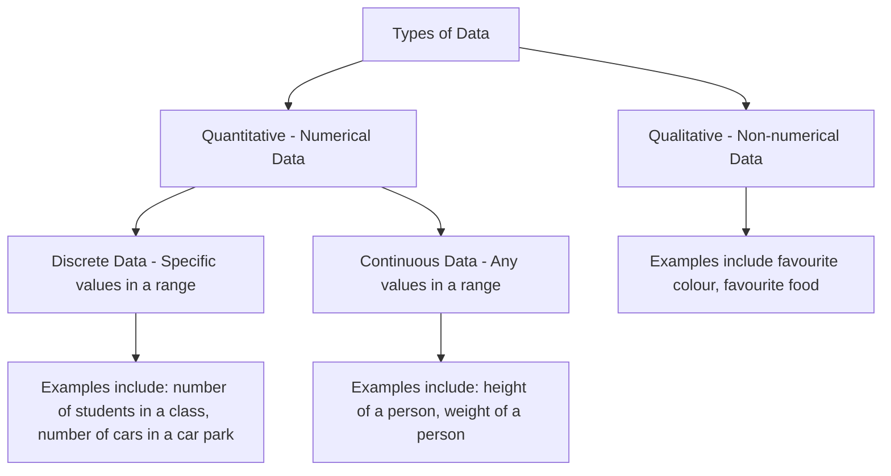
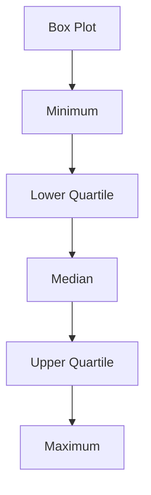

# Statistics 1

###
###
## Chapter 1: Mathematical Modelling
### 1.1 Mathematical Modelling
- A `mathematical model` is a `simplification` of a real-world situation. They are used to make `predictions` about the real world.
- It is a representation of a real-world situation using mathematical concepts and language.
- Mathematical `models` are used to:
  - Describe the real-world situation
  - Predict the behaviour of the real-world situation
  - Explain the behaviour of the real-world situation

Advantages | Disadvantages
---|---
They are relatively quick and easy to make | They are often inaccurate as they are simplifications of the real-world situation
The help predictions to be made | The model may only work in certain situations

### 1.2 Designing a Model
- The process of designing a model involves:
  1) Identifying the real-world situation
  1) A model is devised
  1) Model is used to make predictions about the real-world situation
  1) Experimental data are collected from the real-world
  1) Comparing the predictions with the experimental data
  1) Statistical analysis is used to determine the accuracy of the model
  1) Model is `refined` if necessary

### Chapter 1 Summary
- A mathematical model is a simplification of a real-world situation.
- Mathematical models are used to make predictions about the real-world situation.
- The process of designing a model involves identifying the real-world situation, devising a model, making predictions, collecting experimental data, comparing the predictions with the experimental data, statistical analysis and refining the model if necessary.

#
## Chapter 2: Measures of Location and Spread
### 2.1 Types of Data
- We collect in statistics. Variables associated with non-numerical data are called `qulatiative variables`. Variables associated with numerical data are called `quantitative variables`.
- The flow chart below shows the process of collecting data:

### 2.2 Measures of Central Tendency
A `measure of location` is a single value which describes a set of data. It is used to describe the `centre` of a set of data. The three most common measures of location are:
  - `Mean`
    - The `mean` is the `average` of a set of data. It is calculated by adding all the values in a set of data and dividing by the number of values in the set.
    - Formula for the mean is:
    $$\bar{x} = \frac{\sum_{} x}{n}$$
  - `Median`
    - The `median` is the `middle` value in a set of data. It is calculated by arranging the data in order of size and finding the middle value.
  - `Mode`
    - The `mode` is the `most frequent` value in a set of data. It is calculated by finding the value which occurs most often in a set of data.
- Combining Means
  - If two sets of data have the same number of values, the mean of the combined set of data is calculated by adding the means of the two sets of data and dividing by 
  $$\bar{x} = \frac {n_1 \bar{x_1} + n_2 \bar{x_2}} 2 $$
   
- You can calcualte the mean and median for discrete data from the frequency table. The formula for the mean is:
$$\bar{x} = \frac{\sum_{xf}} {\sum_{f}}$$
- The formula for the median is:
$$\frac{\sum_{xf}} 2$$

### 2.3 Other Measures of Location
- The medain describes the middle of the data set. It splits the data into two halfs. You can calculate the other `Measures of Location` such as the `quartiles` and `percentiles`.
- Below is an example layout of a box plot:

- Use these rules to find the upper and lower quartiles for `discrete data`:
  - To find the lower quartile, divide n by 4, if this is a whole number, the lower quartile is halfway between the datapoint and the one above. If it is not a whole number, `round up` and pick that data point.
    - The formula for the lower quartile is: 
    $$ \frac{n}{4} $$

  - To find the upper quartile, multiply n by 3 and divide by 4, if this is a whole number, the upper quartile is halfway between the datapoint and the one below. If it is not a whole number, `round up` and pick that data point.
    - The formula for the upper quartile is: 
    $$ \frac{3}{4} n $$

- When data is presented in a grouped table we can use a technique called `interpolation` to find the quartiles. Interpolation is a method of estimating a value between two known values. When we use interpolation we asume that the data is `evenly distributed`
  
### 2.4 Measures of Spread
- A measure of spread is a single value which describes how spread out the data is. The three most common measures of spread are:
  - `Range`
    - The `range` is the `difference` between the `largest` and `smallest` values in a set of data.
    - The formula for the range is:
    $$R = x_{max} - x_{min}$$
  - `Interquartile Range`
    - The `interquartile range` is the `difference` between the `upper quartile` and the `lower quartile`.
    - The formula for the interquartile range is:
    $$IQR = Q_3 - Q_1$$
  - `Interpercentile Range`
    - The `interpercentile range` is the `difference` between the `upper percentile` and the `lower percentile`.
    - The formula for the interpercentile range is:
    $$IPR = P_3 - P_1$$

### 2.5 Variance and Standard Deviation
- The `variance` is a measure of spread which describes how spread out the data is. It is calculated by finding the `mean` of the `squared differences` between each value and the `mean` of the data set.'
- The formula for the variance is:
$$\sigma^2 = \frac{\sum_{(x - \bar{x})^2}} n$$
- An other simpiler way to calculate the variance is:
$$\sigma^2 = \frac {\sum_{x^2}}{n} - (\frac {\sum_{x}}{n})^2$$
- The `standard deviation` is a measure of spread which describes how spread out the data is. It is calculated by taking the `square root` of the `variance`.
- The formula for the standard deviation is:
$$\sigma = \sqrt{\frac{\sum_{(x - \bar{x})^2}} n}$$
- A simpiler way to calculate the standard deviation is:
$$\sigma = \sqrt{\frac {\sum_{x^2}}{n} - (\frac {\sum_{x}}{n})^2}$$

### 2.6 Coding
- The `coding` of data is the process of converting qualitative data into numerical data. This is done so values are easier to work with
- The formula for coding is:
$$y = \frac {x - a} {b}$$

- If data is coded using the formula above, the `mean` of the data is 0 and the `standard deviation` is 1.
  - To calculate the mean of the data, use the formula:
  $$\bar{y} = \frac {\bar{x} - a} b$$
  - To calculate the standard deviation of the data, use the formula:
  $$\sigma_y = \frac {\sigma_x} b$$
  - Where $\bar{y}$ is the mean of the coded data, $\bar{x}$ is the mean of the original data, $\sigma_y$ is the standard deviation of the coded data, $\sigma_x$ is the standard deviation of the original data, $a$ is the lowest value in the original data and $b$ is the difference between the highest and lowest values in the original data.

### Chapter 2 Summary
- A `measure of location` is a single value which describes a set of data. It is used to describe the `centre` of a set of data. The three most common measures of location are:
  - `Mean`
  - `Median`
  - `Mode`

- A `measure of spread` is a single value which describes how spread out the data is. The three most common measures of spread are:
  - `Range`
  - `Interquartile Range`
  - `Interpercentile Range`

- The `variance` is a measure of spread which describes how spread out the data is. It is calculated by finding the `mean` of the `squared differences` between each value and the `mean` of the data set.

- The `standard deviation` is a measure of spread which describes how spread out the data is. It is calculated by taking the `square root` of the `variance`.
  - The simple formula for $\sigma$ is:
  $$\sigma = \sqrt{\frac {\sum_{x^2}}{n} - (\frac {\sum_{x}}{n})^2}$$

- The `coding` of data is the process of converting qualitative data into numerical data. This is done so values are easier to work with.
  - The formula for this is:
  $$y = \frac {x - a} {b}$$
  - Where $y$ is the coded value, $x$ is the original value, $a$ is the lowest value in the original data and $b$ is the difference between the highest and lowest values in the original data.

## Chapter 3: Representations of Data
### 3.1 Histograms
- A `histogram` is a `graphical representation` of a `frequency distribution`. It is used to show the `frequency` of each `class` in a `grouped frequency table`.
  
- The `class interval` is the `range` of values in a `class`.
### 3.2 Outliers
### 3.3 Box Plots
### 3.4 Stem and Leaf Plots
### 3.5 Skewnness
### 3.6 Comparing Data

## Chapter 4: Probability
### 4.1 Understanding The Vocabulary used in Probability
### 4.2 Venn Diagrams
### 4.3 Mutually Exclusive and Independent Events
### 4.4 Set Notation
### 4.5 Conditional Probability
### 4.6 Conditional Probability in Venn Diagrams
### 4.7 Probability Formulae
### 4.8 Tree Diagrams

## Chapter 5: Correlation and Regression
### 5.1 Scatter Diagrams
### 5.2 Linear Regression
### 5.3 Calculating Least Squares Linear Regression
### 5.4 The Product Moment Correlation Coefficient

## Chapter 6: Discrete Random Variables
### 6.1 Discrete Random Variables
### 6.2 Finding the Cumulative Distribution Function for a Discrete Random Variable
### 6.3 Expected Value of a Discrete Random Variable
### 6.4 Variance of a Discrete Random Variable
### 6.5 Expected Value and Variance of a Function of X
### 6.6 Solving Problems Involving Discrete Random Variables
### 6.7 Using Discrete Uniform Distribution as a Model for the Probability Distribution of the Outcomes of Certain Experiments

## Chapter 7: The Normal Distribution
### 7.1 The Normal Distribution
### 7.2 Using Tables to Find Probabilities of The Standard Normal Distribution Z
### 7.3 Using Tables to find The Value of Z for a Given Probability
### 7.4 The Standard Normal Distribution
### 7.5 Finding μ and σ
